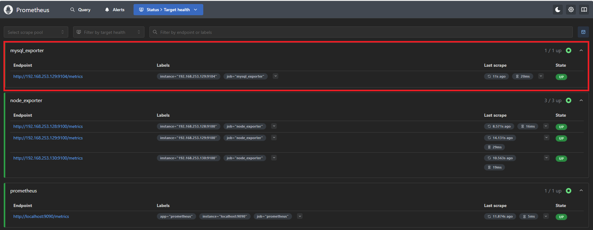
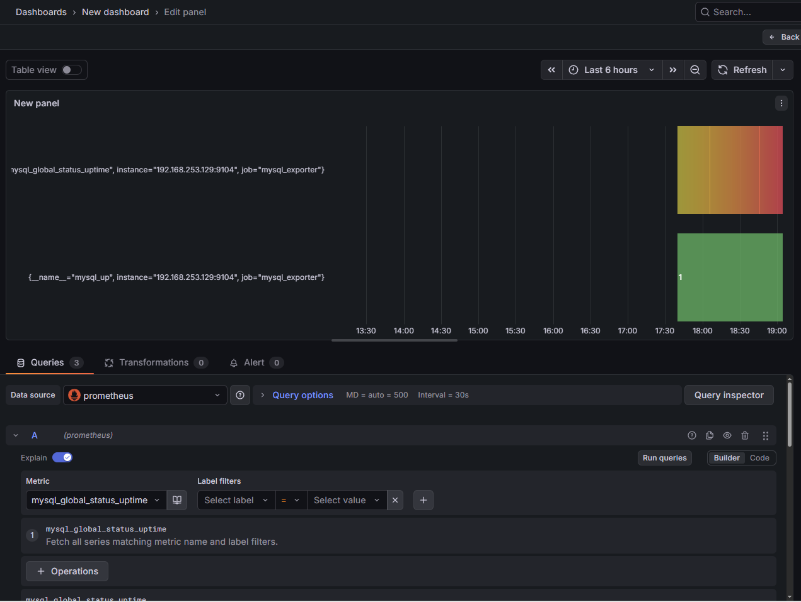

# Prometheus + Grafana — Linux Server Monitoring


## Project Overview

In this project, I have set up a monitoring system using Prometheus and Grafana.
Multiple VMs are used where Prometheus collects metrics from different nodes using Node Exporter, and Grafana is used to visualize those metrics.
This setup helps in understanding how infrastructure monitoring works in real environments.

---
---

## What is Prometheus?

Prometheus is an open-source tool that collects and stores data about your servers and applications.
It records real-time numbers like CPU usage, memory usage, disk space and number of users using an application.

It works on a pull model, which means it actively goes to your servers and checks their current state and records that information every few seconds or minutes.
This makes it easy to know if any node or machine is down — if Prometheus cannot reach it, something is wrong.

---

## What is Grafana?

Grafana is a visualization platform. It connects to various data sources like Prometheus, Elasticsearch, Loki and turns that stored data into dashboards with graphs, charts, tables and alerts.

For example: We can see a graph showing how our CPU has been doing in the past 24 hours.

---

## Why Prometheus and Grafana are Used Together

Prometheus collects and stores metrics. Grafana visualizes them.
Prometheus does not have a strong visualization layer, and Grafana does not store metrics.
Together they form the standard monitoring stack in DevOps environments.

---

## What is Node Exporter?

Node Exporter is a small program that runs on Linux machines. It collects information about the server — CPU, memory, disk, network — and exposes them on port 9100 for Prometheus to collect.

---

## What is Alert Manager?

Alert Manager handles alerts. When Prometheus finds a problem, it sends a message to Alert Manager. Alert Manager decides what to do — it can send an email, a Slack message, or group many alerts together.

---
## What this Project Demonstrates

- Monitoring multiple servers from a central system  
- Collecting CPU, Memory, Disk metrics using Node Exporter  
- Visualizing metrics using Grafana dashboards  
- Understanding real-time infrastructure monitoring  

---

## Problem

In a multi-server environment, monitoring each Linux machine manually is not scalable. There is no central visibility into CPU, memory, disk and network across multiple nodes at the same time.

## Solution

Set up a centralized monitoring stack using Prometheus to scrape metrics from 3 Linux VMs via Node Exporter, with Grafana providing real-time visualization through Dashboard 1860.

## Why This Stack

Prometheus and Grafana are the standard open-source monitoring stack used in production DevOps environments. It works without any cloud dependency and can scale to hundreds of servers by just adding targets to `prometheus.yml`.

## Production Use

Teams use this exact setup to monitor infrastructure health 24/7, detect failures early, and set up automated alerts before problems affect end users.

---

## VM Setup

| VM | Role | IP |
|----|------|----|
| LVM1 | Prometheus + Grafana Server | 192.168.253.128 |
| LVM2 | Target Machine 1 (Node Exporter) | 192.168.253.129 |
| LVM3 | Target Machine 2 (Node Exporter) | 192.168.253.130 |

## Architecture

```
LVM2 (Node Exporter :9100)  ─┐
                              ├──► Prometheus (:9090) ──► Grafana (:3000)
LVM3 (Node Exporter :9100)  ─┘
LVM1 (Node Exporter :9100)  ─┘
```

## Port Summary

| Service | Port |
|---------|------|
| Prometheus | 9090 |
| Node Exporter | 9100 |
| Grafana | 3000 |
| Alert Manager | 9093 |

---

## Key Concepts

**Pull Model** — Prometheus pulls metrics from nodes. It does not wait for nodes to send data. If Prometheus cannot pull metrics, the node is marked as down.

**Time-Series Data** — Each data point has a timestamp and value. This allows us to see trends like how CPU usage changed over the last hour.

**Labels** — Key-value pairs attached to metrics. For example: `instance="10.0.0.1"` and `mode="idle"`. Makes it easy to filter and group data.

**PromQL** — Prometheus Query Language. A simple query like `node_memory_MemAvailable_bytes` gives us available memory.

---
## Step 1 — Prepare the System

```bash
# Update all packages
dnf update -y
reboot
```

```bash
# Disable SELinux so it does not block Prometheus
setenforce 0

# To make this permanent across reboots
vi /etc/selinux/config
# change SELINUX=enforcing to SELINUX=permissive
```

---

## Step 2 — Create Prometheus User and Directories

```bash
# Create prometheus user with no home directory and no login shell
# This user runs the service with minimal privileges
sudo useradd --no-create-home --shell /usr/sbin/nologin prometheus
```

```bash
# /etc/prometheus holds config files
# /var/lib/prometheus holds metrics data
mkdir /etc/prometheus
mkdir /var/lib/prometheus
```

```bash
# Set ownership so prometheus user can read/write these directories
chown -R prometheus:prometheus /etc/prometheus
chown -R prometheus:prometheus /var/lib/prometheus
```

---

## Step 3 — Download and Install Prometheus

```bash
cd /tmp

# Download Prometheus tarball from GitHub releases
wget https://github.com/prometheus/prometheus/releases/download/v3.10.0/prometheus-3.10.0.linux-amd64.tar.gz

# Extract
tar -xf prometheus-3.10.0.linux-amd64.tar.gz

cd prometheus-3.10.0.linux-amd64
```

```bash
# Copy binaries to /usr/local/bin so they can be run from anywhere
cp prometheus /usr/local/bin/
cp promtool /usr/local/bin/

# Set ownership to prometheus user
chown prometheus:prometheus /usr/local/bin/prometheus
chown prometheus:prometheus /usr/local/bin/promtool
```

```bash
# Copy configuration file used by Prometheus web UI
cp prometheus.yml /etc/prometheus/prometheus.yml
```

---

## Step 4 — Create Prometheus Systemd Service

```bash
vi /etc/systemd/system/prometheus.service
```

```ini
[Unit]
Description=Prometheus Monitoring
Wants=network-online.target
After=network-online.target

[Service]
User=prometheus
Group=prometheus
Type=simple
ExecStart=/usr/local/bin/prometheus \
  --config.file=/etc/prometheus/prometheus.yml \
  --storage.tsdb.path=/var/lib/prometheus \
  

[Install]
WantedBy=multi-user.target
```

```bash
systemctl daemon-reload
systemctl start prometheus
systemctl enable prometheus
systemctl status prometheus
```

---

## Step 5 — Open Firewall for Prometheus

```bash
# Open port 9090 so Prometheus web UI is accessible from browser
firewall-cmd --permanent --add-port=9090/tcp --zone=public
firewall-cmd --reload
```

Access Prometheus dashboard at `http://192.168.253.128:9090`


Go to **Status → Targets** — Prometheus should be scraping itself. This confirms installation is successful.

---

## Step 6 — Install Node Exporter

Node Exporter runs on every Linux server we want to monitor. Install this on LVM1 first, then repeat on LVM2 and LVM3.

```bash
mkdir -p /var/lib/prometheus/node_exporter

cd /tmp
wget https://github.com/prometheus/node_exporter/releases/download/v1.10.2/node_exporter-1.10.2.linux-amd64.tar.gz
tar xvf node_exporter-1.10.2.linux-amd64.tar.gz
cd node_exporter-1.10.2.linux-amd64

cp node_exporter /usr/local/bin/
```

```bash
# Create dedicated user and set permissions
useradd --no-create-home --shell /usr/sbin/nologin node_exporter
chown node_exporter:node_exporter /usr/local/bin/node_exporter
```

```bash
vi /usr/lib/systemd/system/node_exporter.service
```

```ini
[Unit]
Description=Node Exporter
Wants=network-online.target
After=network-online.target

[Service]
User=node_exporter
Group=node_exporter
Type=simple
ExecStart=/usr/local/bin/node_exporter

[Install]
WantedBy=multi-user.target
```

```bash
systemctl daemon-reload
systemctl enable node_exporter
systemctl start node_exporter
systemctl status node_exporter
```

```bash
# Open firewall for Node Exporter — port 9100
firewall-cmd --permanent --add-port=9100/tcp --zone=public
firewall-cmd --reload
```

Verify Node Exporter metrics endpoint at `http://192.168.253.128:9100/metrics` — we should see a long list of metrics.


---

## Step 7 — Add Node Exporter to Prometheus Config

```bash
vi /etc/prometheus/prometheus.yml
```

At the end of the file add this block. YAML is space-sensitive so make sure indentation is correct.

```yaml
  - job_name: "node_exporter"
    static_configs:
      - targets: ["192.168.253.128:9100"]
```


```bash
# Always validate config before restarting
promtool check config /etc/prometheus/prometheus.yml

systemctl restart prometheus
systemctl status prometheus
```

Check Prometheus Targets page — both prometheus and node_exporter should show as UP.

```
http://192.168.253.128:9090/targets
```


---

## Step 8 — Install Grafana

For Prometheus we used tarball installation because no official DNF repository exists for RHEL systems. For Grafana, an official repository exists so we use that.

```bash
vi /etc/yum.repos.d/grafana.repo
```

```ini
[grafana]
name=grafana
baseurl=https://packages.grafana.com/oss/rpm
repo_gpgcheck=1
enabled=1
gpgcheck=1
gpgkey=https://packages.grafana.com/gpg.key
sslverify=1
sslcacert=/etc/pki/tls/certs/ca-bundle.crt
```

```bash
# Force DNF to read the new repo and cache available packages
dnf makecache -y

dnf install grafana -y

systemctl start grafana-server
systemctl enable grafana-server
systemctl status grafana-server
```

```bash
# Open firewall for Grafana — port 3000
firewall-cmd --permanent --add-port=3000/tcp
firewall-cmd --reload
```

Access Grafana at `http://192.168.253.128:3000`

Default login: `admin / admin` — change password on first login.

---

## Step 9 — Add Prometheus as Data Source in Grafana

- Left sidebar → **Connections** → **Data Sources**
- Click **Add data source** → select **Prometheus**
- In URL field enter: `http://192.168.253.128:9090`
- Click **Save & Test**


Green message should appear confirming data source is working.


---

## Step 10 — Import Dashboard 1860

Dashboard 1860 is a community-built Grafana dashboard for Node Exporter. It shows CPU, RAM, disk, network and load in a clean visual format.

Direct import by ID may fail if Grafana cannot reach grafana.com from the VM. Download the JSON on your Windows machine and upload manually.

Download JSON:
```
https://grafana.com/api/dashboards/1860/revisions/latest/download
```


- Go to **Dashboards** → **Import**
- Click **Upload JSON file** → select downloaded file
- Select **Prometheus** as data source
- Click **Import**


---

# Adding More VMs for Monitoring

## Install Node Exporter on LVM2 and LVM3

Run these steps on each additional VM:

```bash
dnf update -y

useradd --no-create-home --shell /usr/sbin/nologin node_exporter

cd /tmp
wget https://github.com/prometheus/node_exporter/releases/download/v1.10.2/node_exporter-1.10.2.linux-amd64.tar.gz
tar -xvf node_exporter-1.10.2.linux-amd64.tar.gz
cd node_exporter-1.10.2.linux-amd64

cp node_exporter /usr/local/bin/
chown node_exporter:node_exporter /usr/local/bin/node_exporter
```

```bash
vi /usr/lib/systemd/system/node_exporter.service
```

```ini
[Unit]
Description=Node Exporter
Wants=network-online.target
After=network-online.target

[Service]
User=node_exporter
Group=node_exporter
Type=simple
ExecStart=/usr/local/bin/node_exporter

[Install]
WantedBy=multi-user.target
```

```bash
systemctl daemon-reload
systemctl enable node_exporter
systemctl start node_exporter
systemctl status node_exporter

firewall-cmd --permanent --add-port=9100/tcp --zone=public
firewall-cmd --reload
```

Verify both VMs are accessible:

```
http://192.168.253.129:9100/metrics
http://192.168.253.130:9100/metrics
```

---

## Add LVM2 and LVM3 to Prometheus Config

On the Prometheus server (LVM1):

```bash
vi /etc/prometheus/prometheus.yml
```

Add both VMs at the end:

```yaml
  - job_name: "node_exporter_LVM2"
    static_configs:
      - targets: ["192.168.253.129:9100"]

  - job_name: "node_exporter_LVM3"
    static_configs:
      - targets: ["192.168.253.130:9100"]
```


```bash
promtool check config /etc/prometheus/prometheus.yml
systemctl restart prometheus
```

Check targets page — all 3 VMs should show as UP.

```
http://192.168.253.128:9090/targets
```


---

## View All VMs in Grafana

The 1860 dashboard has a **job** dropdown at the top. After adding more VMs, each VM appears as a separate option. Select any VM to see its metrics. No changes needed in Grafana — Prometheus feeds the data automatically.


---

# Output

- Prometheus running and scraping metrics on port 9090
- Node Exporter exposing Linux system metrics on port 9100
- All 3 targets showing UP in Prometheus targets page
- Grafana connected to Prometheus as data source
- Dashboard 1860 showing CPU, memory, disk, and network metrics in real time
- Job dropdown in Grafana showing all 3 VMs separately

---

## Key Files and Directories

| Path | Description |
|------|-------------|
| `/etc/prometheus/prometheus.yml` | Main Prometheus config file |
| `/var/lib/prometheus` | Metrics data storage |
| `/etc/systemd/system/prometheus.service` | Prometheus service file |
| `/usr/lib/systemd/system/node_exporter.service` | Node Exporter service file |
| `/etc/yum.repos.d/grafana.repo` | Grafana repository file |
| `/var/log/grafana/grafana.log` | Grafana logs |

---

# Troubleshooting

| Issue | Cause | Fix |
|-------|-------|-----|
| Prometheus service fails to start | Wrong permissions on directories | `chown -R prometheus:prometheus /etc/prometheus /var/lib/prometheus` |
| Targets showing DOWN in Prometheus | Firewall blocking port 9100 | `firewall-cmd --add-port=9100/tcp --zone=public --permanent` |
| Grafana cannot reach Prometheus | Wrong URL in data source | Use `http://<server-ip>:9090` not localhost |
| Dashboard 1860 import fails - Bad Gateway | Grafana cannot reach grafana.com | Download JSON on Windows, upload manually |
| Node Exporter not showing metrics | Service not running | `systemctl status node_exporter` and check logs |
| promtool check fails | YAML indentation error in prometheus.yml | Check spacing — YAML is space-sensitive |

---


# MySQL Database Monitoring — Prometheus + Grafana


---

## Problem

Linux server monitoring alone is not enough in production environments. Database servers need separate monitoring — slow queries, active connections, replication status, and uptime are not visible through Node Exporter. A database going down or becoming slow can silently affect applications.

## Solution

Extend the existing Prometheus + Grafana monitoring stack with MySQL Exporter to scrape MariaDB metrics from a dedicated database VM and visualize them in Grafana.

## Why This Approach

MySQL Exporter follows the same pull model as Node Exporter. This means no changes are needed in Prometheus or Grafana setup — just add a new target and the existing stack handles the rest. This is exactly how production teams add monitoring for new services without rebuilding the stack.

## Production Use

Database monitoring is critical in production. Teams monitor active connections to detect connection pool exhaustion, query performance to detect slow queries, and replication lag to detect sync issues between primary and replica databases.

---

## VM Setup

| VM | IP | Role |
|----|-----|------|
| LVM1 | 192.168.253.128 | Prometheus + Grafana (existing) |
| LVM2 | 192.168.253.129 | MariaDB + MySQL Exporter |

## Port Summary

| Service | Port |
|---------|------|
| MariaDB | 3306 |
| MySQL Exporter | 9104 |
| Prometheus | 9090 |
| Grafana | 3000 |

---

# Implementation

## Step 1 — Install MariaDB on LVM2

```bash
sudo dnf install mariadb-server -y
sudo systemctl start mariadb
sudo systemctl enable mariadb
sudo systemctl status mariadb
```

Run secure installation to set root password and remove test databases.

```bash
sudo mysql_secure_installation
```

---

## Step 2 — Create Exporter User in Database

MySQL Exporter needs a dedicated database user with read-only permissions. We do not use root — minimal privileges only.

```bash
mysql -u root -p
```

```sql
CREATE USER 'exporter'@'localhost' IDENTIFIED BY 'exporter123';
GRANT PROCESS, REPLICATION CLIENT, SELECT ON *.* TO 'exporter'@'localhost';
FLUSH PRIVILEGES;
EXIT;
```

---

## Step 3 — Install MySQL Exporter on LVM2

```bash
cd /tmp
wget https://github.com/prometheus/mysqld_exporter/releases/download/v0.19.0/mysqld_exporter-0.19.0.linux-amd64.tar.gz
tar -xvf mysqld_exporter-0.19.0.linux-amd64.tar.gz
cd mysqld_exporter-0.19.0.linux-amd64
sudo cp mysqld_exporter /usr/local/bin/
```

---

## Step 4 — Create Dedicated Linux User for Exporter

```bash
sudo useradd --no-create-home --shell /usr/sbin/nologin mysqld_exporter
sudo chown mysqld_exporter:mysqld_exporter /usr/local/bin/mysqld_exporter
```

---

## Step 5 — Create Password Configuration File

MySQL Exporter reads database credentials from a config file. We keep credentials separate from the service file for security.

```bash
sudo vi /etc/mysql_exporter.cnf
```

```ini
[client]
user=exporter
password=exporter123
```

```bash
# Set ownership and restrict permissions — only mysqld_exporter user can read this file
sudo chown mysqld_exporter:mysqld_exporter /etc/mysql_exporter.cnf
sudo chmod 600 /etc/mysql_exporter.cnf
```

---

## Step 6 — Create Systemd Service

```bash
sudo vi /etc/systemd/system/mysqld_exporter.service
```

```ini
[Unit]
Description=MySQL Exporter
After=network.target

[Service]
User=mysqld_exporter
Group=mysqld_exporter
Type=simple
ExecStart=/usr/local/bin/mysqld_exporter --config.my-cnf=/etc/mysql_exporter.cnf

[Install]
WantedBy=multi-user.target
```

```bash
sudo systemctl daemon-reload
sudo systemctl start mysqld_exporter
sudo systemctl enable mysqld_exporter
sudo systemctl status mysqld_exporter
```

---

## Step 7 — Open Firewall for MySQL Exporter

```bash
sudo firewall-cmd --permanent --add-port=9104/tcp
sudo firewall-cmd --reload
```

---

## Step 8 — Add MySQL Exporter Target to Prometheus (on LVM1)

```bash
sudo vi /etc/prometheus/prometheus.yml
```

Add at the end of the file:

```yaml
  - job_name: 'mysql_exporter'
    static_configs:
      - targets: ['192.168.253.129:9104']
```

```bash
# Always validate before restarting
promtool check config /etc/prometheus/prometheus.yml

sudo systemctl restart prometheus
```

---

## Step 9 — Verify in Prometheus

Open Prometheus targets page:

```
http://192.168.253.128:9090/targets
```

`mysql_exporter` status should show as **UP**.




---

## Step 10 — Add MySQL Dashboard in Grafana

Open Grafana at `http://192.168.253.128:3000`

- **Dashboards** → **New** → **New Dashboard** → **Add visualization**
- Select **Prometheus** as data source
- Run query: `mysql_up`
- Save dashboard as **MySQL Monitoring**



---

## Key Files

| File | Purpose |
|------|---------|
| `/etc/mysql_exporter.cnf` | Database credentials for exporter |
| `/etc/systemd/system/mysqld_exporter.service` | Exporter service file |
| `/etc/prometheus/prometheus.yml` | Prometheus configuration — target added here |

---
## Challenges I Faced

1. **Grafana Dashboard Import Failed**
   - Issue: Direct import by ID from grafana.com failed because the VM had no internet access
   - Fix: Downloaded the JSON file on a Windows machine and uploaded it manually to Grafana
  
## Troubleshooting

| Issue | Cause | Fix |
|-------|-------|-----|
| mysql_exporter target showing DOWN | Firewall blocking port 9104 | `firewall-cmd --add-port=9104/tcp --permanent` |
| Exporter fails to connect to DB | Wrong credentials in cnf file | Check `/etc/mysql_exporter.cnf` — verify user and password |
| Permission denied on cnf file | Wrong file ownership | `chown mysqld_exporter:mysqld_exporter /etc/mysql_exporter.cnf` |
| mysql_up query returns 0 | MariaDB service not running | `systemctl start mariadb` |
| Prometheus not scraping mysql target | Config syntax error | `promtool check config /etc/prometheus/prometheus.yml` |

## What's Next

This setup can be further extended with:
- **Replication Monitoring** — add a replica MariaDB server and monitor replication lag
- **PostgreSQL Exporter** — same approach, monitor PostgreSQL databases
- **Ansible Automation** — deploy MySQL Exporter across multiple database servers using playbooks

## Exporters commonly used in the production environment.

| Priority | Exporter | When to Use |
|----------|----------|-------------|
| 1 | Node Exporter | Always - every Linux system needs this |
| 2 | Blackbox Exporter | When monitoring website uptime from outside |
| 3 | MySQL/PostgreSQL Exporter | When monitoring databases |
| 4 | Nginx/Apache Exporter | When monitoring web servers |
| 5 | Rsyslog Exporter | For centralized logging projects |
| 6 | cAdvisor + kube-state-metrics | For Kubernetes monitoring |


*Document prepared as part of DevOps Home Lab — Linux Server Configuration *
