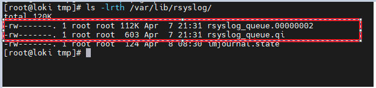
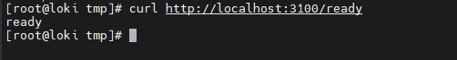
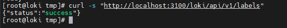
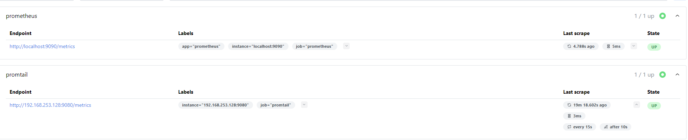
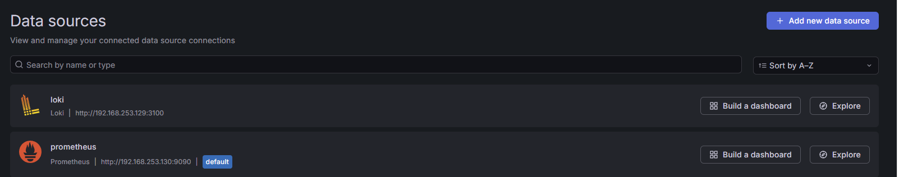
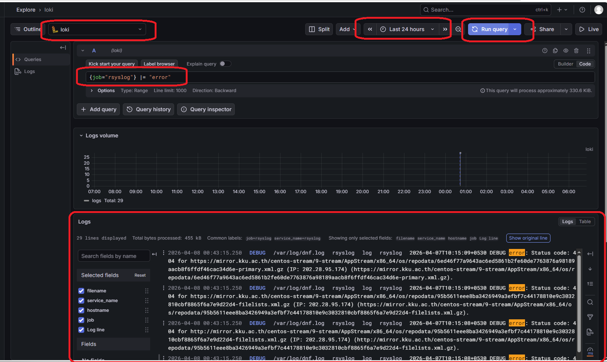

# 📋 Rsyslog Centralized Logging with Loki, Promtail, Prometheus & Grafana


---

## Project Overview

## Project Summary
Implemented a centralized logging system using Rsyslog with disk queue reliability and log rotation. Logs are aggregated from multiple clients into a single server and integrated with Loki for monitoring.

In a production environment, logs are scattered across many different servers. It is not practical to log into every machine individually to troubleshoot issues. This project builds a complete centralized logging and monitoring solution from scratch — collecting logs from multiple client machines, making them searchable through Loki, and visualizing them alongside system metrics in Grafana.

---

## What This Project Demonstrates

- Setting up Rsyslog as a centralized log collection server to receive logs from multiple clients over TCP
- Configuring dynamic log storage using Rsyslog templates — automatically creating separate folders per client hostname
- Implementing disk-assisted queues on client machines to ensure zero log loss during server downtime
- Automating log rotation and disk management with Logrotate
- Installing and configuring Loki as a log aggregation and indexing engine
- Deploying Promtail on the log server to read local log files and forward them to Loki
- Deploying Prometheus to collect metrics and Grafana to visualize both logs and metrics from a single dashboard
- Querying logs in Grafana using LogQL with label-based filtering by hostname, job, and severity

---

## Architecture

```
VM1 (rsyslogserver) 192.168.253.128   —   Rsyslog Server + Promtail
VM2 (loki)          192.168.253.129   —   Loki (Log Storage & Indexing)
VM3 (prometheus)    192.168.253.130   —   Prometheus + Grafana
```

**Full Data Flow:**
```
VM2 (loki) ─────────────────────────────────────────────────────────┐
                          TCP 514                                     ▼
VM3 (prometheus) ──────────────────────────► VM1 Rsyslog stores logs
                                              /var/log/%HOSTNAME%/
                                                       │
                                                       ▼
                                          VM1 Promtail reads local files
                                                       │  HTTP Push
                                                       ▼
                                          VM2 Loki indexes logs
                                                       │
                                                       ▼
                                          VM3 Grafana displays logs + metrics
                                          VM3 Prometheus scrapes metrics
```

---

## Production Use

| This Lab | Production Equivalent |
|---|---|
| Rsyslog on VM1 collecting logs | Centralized syslog server receiving logs from 100+ nodes |
| Disk-assisted queues on clients | Zero log loss during network outages or server restarts |
| Logrotate managing /var/log | Automated log lifecycle management preventing disk fill |
| Promtail reading local files | Log agents deployed on every node forwarding to central Loki |
| Loki indexing by hostname and job | Log streams queryable by service, environment, and region |
| Grafana LogQL queries | SRE teams filtering incidents by time, host, and severity |
| Prometheus scraping Promtail | Monitoring the health of the logging infrastructure itself |

---

---

## Technology Stack

| Tool | Role | VM |
|---|---|---|
| Rsyslog | Centralized log collection and storage | VM1 |
| Promtail | Log file reader — reads and forwards logs to Loki | VM1 |
| Loki | Log aggregation system with indexing and search | VM2 |
| Prometheus | Metrics collection and storage | VM3 |
| Grafana | Visualization and dashboard for logs and metrics | VM3 |

---

## Project Phases

### Phase 1 — Basic Centralized Logging
Configured Rsyslog server on VM1 to receive logs from client machines via TCP port 514. Configured VM2 and VM3 as clients to forward all logs to VM1. Created dynamic log storage using templates so each client gets its own folder automatically under `/var/log/<hostname>/`.

### Phase 2 — Reliability with Disk-Assisted Queues
Configured disk queues on client machines. When the central server is unreachable, logs are saved to local disk and automatically sent once the server is back online. Eliminates log loss during network failures.

### Phase 3 — Log Rotation with Logrotate
Configured logrotate to automatically compress, archive, and delete old logs daily. Keeps the last 7 days of logs and prevents disk from filling up.

### Phase 4 — Log Indexing and Search (Loki + Promtail)
Installed Loki on VM2 for log storage and indexing. Installed Promtail on VM1 (where logs are stored) to read log files locally and push them to Loki. Logs are now searchable by time range, hostname, job, and content through Grafana.

### Phase 5 — Metrics and Dashboard (Prometheus + Grafana)
Installed Prometheus on VM3 for metrics collection. Installed Grafana on VM3 and configured both Prometheus and Loki as data sources. Grafana dashboard provides visibility into both metrics and logs from a single location.

---

---

## Setup and Implementation

### Phase 1 — Rsyslog Server (VM1)

**Install and Start Rsyslog:**
```bash
dnf install -y rsyslog
systemctl start rsyslog
systemctl enable rsyslog
```

**Enable TCP input — open `/etc/rsyslog.conf` and uncomment:**
```
module(load="imtcp")
input(type="imtcp" port="514")
```

**Create Dynamic Log Storage — add to `/etc/rsyslog.conf`:**
```
$template RemoteLogs, "/var/log/%HOSTNAME%/%PROGRAMNAME%.log"
*.* ?RemoteLogs
```
- `%HOSTNAME%` — Creates a folder named after the client. Example: `/var/log/loki/`
- `%PROGRAMNAME%` — Creates a file named after the app. Example: `sshd.log`

**Open Firewall:**
```bash
firewall-cmd --permanent --add-port=514/tcp
firewall-cmd --reload
```

**Verify Rsyslog is listening on port 514:**
```bash
ss -tlnp | grep 514
```

**Set SELinux to permissive (lab only):**
```bash
vi /etc/selinux/config
# Change SELINUX=enforcing to SELINUX=permissive
```

---

### Phase 1 — Rsyslog Client Configuration (VM2 and VM3)

**Set SELinux to permissive on clients:**
```bash
vi /etc/selinux/config
# Change SELINUX=enforcing to SELINUX=permissive
```

**Open Firewall on clients:**
```bash
firewall-cmd --permanent --add-port=514/tcp
firewall-cmd --reload
```

**Enable log forwarding — add at end of `/etc/rsyslog.conf`:**
```
*.* @@192.168.253.128:514
```
- `*.*` — Send all logs
- `@@` — Use TCP protocol. Single `@` = UDP
- `192.168.253.128:514` — Server IP and port

**Test the connection from client:**
```bash
logger "Hello from Client"
```
Check on VM1 — client folder should appear under `/var/log/`

```
Dynamic Client Log Folders Created Automatically
/var/log/
├── loki/
│   ├── rsyslogd.log
│   ├── sshd.log
│   └── root.log
├── prometheus/
│   ├── rsyslogd.log
│   └── root.log
└── rsyslogserver/
    └── rsyslogd.log
```


---

### Phase 2 — Disk Queue Configuration (VM2 and VM3)

**Add to `/etc/rsyslog.conf` above the forwarding rule:**
```
*.* action(type="omfwd"
    target="192.168.253.128"
    port="514"
    protocol="tcp"
    action.resumeRetryCount="-1"
    queue.type="LinkedList"
    queue.filename="rsyslog_queue"
    queue.maxDiskSpace="1g"
    queue.saveOnShutdown="on")
```
- `action.resumeRetryCount="-1"` — Keep retrying forever when server is down
- `queue.maxDiskSpace="1g"` — Maximum 1 GB disk space for queue
- `queue.saveOnShutdown="on"` — Save pending logs to disk on service stop so nothing is lost on restart

**Setup Permissions for Queue:**
```bash
sudo useradd -r -s /sbin/nologin rsyslog
sudo mkdir -p /var/lib/rsyslog/
sudo chown rsyslog:rsyslog /var/lib/rsyslog/
systemctl restart rsyslog
```
```
Disk Queue Files on Client (when server is stopped)
/var/lib/rsyslog/
└── rsyslog_queue.qi    ← queue index file created automatically when server is unreachable
```




---

### Phase 3 — Logrotate Configuration (VM1)

**Create file — do not edit main `/etc/logrotate.conf`:**
```bash
vim /etc/logrotate.d/rsyslog_custom
```

```
/var/log/loki/*.log
/var/log/prometheus/*.log
{
    daily
    rotate 7
    compress
    delaycompress
    missingok
    notifempty
    create 0640 root root
}
```

| Rule | Purpose |
|---|---|
| `daily` | Rotate logs every single day |
| `rotate 7` | Keep last 7 days. On 8th day oldest is deleted |
| `compress` | Compress rotated file with gzip to save disk space |
| `delaycompress` | Do not compress the most recently rotated file immediately — process may still be writing to it |
| `missingok` | If file is missing, skip without error |
| `notifempty` | Skip rotation if file is empty |
| `create 0640 root root` | Create new empty log file after rotation so Rsyslog can keep writing |

**Test immediately:**
```bash
logrotate -f /etc/logrotate.d/rsyslog_custom
ls -lrth /var/log/loki/
```
```
 Logrotate Output
/var/log/loki/
├── root.log            ← current active log
├── root.log.1          ← yesterday's rotated log
└── root.log.2.gz       ← day before, compressed
```


---

### Phase 4 — Loki Installation (VM2)

**Download:**
```bash
cd /tmp
wget https://github.com/grafana/loki/releases/latest/download/loki-linux-amd64.zip
unzip loki-linux-amd64.zip
```

**Move binary to system path:**
```bash
mv loki-linux-amd64 /usr/local/bin/loki
```

**Give execute permission:**
```bash
chmod +x /usr/local/bin/loki
```

**Fix SELinux context:**
```bash
restorecon -v /usr/local/bin/loki
```
When a binary is moved from `/tmp/`, it carries the wrong SELinux label. This resets it. Without this, systemd throws `203/EXEC` error.

**Create Loki user:**
```bash
useradd -r -s /sbin/nologin loki
```

**Create directories:**
```bash
mkdir -p /var/lib/loki/chunks
mkdir -p /var/lib/loki/rules
chown -R loki:loki /var/lib/loki
```

**Open firewall:**
```bash
sudo firewall-cmd --permanent --add-port=3100/tcp
sudo firewall-cmd --reload
```

**Create config file:**
```bash
vim /etc/loki-config.yaml
```

```yaml
auth_enabled: false

server:
  http_listen_port: 3100

common:
  instance_addr: 127.0.0.1
  path_prefix: /var/lib/loki
  ring:
    kvstore:
      store: inmemory
  replication_factor: 1
  storage:
    filesystem:
      chunks_directory: /var/lib/loki/chunks
      rules_directory: /var/lib/loki/rules

schema_config:
  configs:
    - from: 2024-01-01
      store: tsdb
      object_store: filesystem
      schema: v13
      index:
        prefix: index_
        period: 24h

limits_config:
  allow_structured_metadata: false
```

| Setting | Purpose |
|---|---|
| `auth_enabled: false` | Authentication disabled — lab environment |
| `http_listen_port: 3100` | Loki runs on port 3100 |
| `store: inmemory` | Single node — no Consul or cluster needed |
| `store: tsdb` | New indexing engine required for Loki 3.x |
| `schema: v13` | Minimum required schema version for Loki 3.x |
| `allow_structured_metadata: false` | Required to avoid config validation errors in Loki 3.x |

**Create systemd service:**
```bash
vim /etc/systemd/system/loki.service
```

```ini
[Unit]
Description=Loki Service
After=network.target

[Service]
User=loki
Group=loki
WorkingDirectory=/var/lib/loki
ExecStart=/usr/local/bin/loki -config.file=/etc/loki-config.yaml
Restart=always
RestartSec=5

[Install]
WantedBy=multi-user.target
```

**Start Loki:**
```bash
systemctl daemon-reexec
systemctl daemon-reload
systemctl start loki
systemctl enable loki
systemctl status loki
```

**Verify:**
```bash
curl http://localhost:3100/ready
# Expected output: ready
```


---

### Phase 4 — Promtail Installation (VM1)

> **Why Promtail on VM1 and not VM2?**
> All logs are stored on VM1 under `/var/log/`. Promtail reads files directly from disk. Installing Promtail on VM2 would require NFS mount to access VM1's files — extra complexity and extra failure points. Promtail reads locally on VM1 and only pushes over network to Loki on VM2.

**Download:**
```bash
cd /tmp
wget https://github.com/grafana/loki/releases/download/v2.9.9/promtail-linux-amd64.zip
unzip promtail-linux-amd64.zip
```

**Move binary, set permissions, fix SELinux:**
```bash
sudo mv promtail-linux-amd64 /usr/local/bin/promtail
sudo chmod +x /usr/local/bin/promtail
sudo restorecon -v /usr/local/bin/promtail
/usr/local/bin/promtail --version
```

**Create user and directory:**
```bash
sudo useradd -r -s /sbin/nologin promtail
sudo mkdir -p /var/lib/promtail
sudo chown -R promtail:promtail /var/lib/promtail
```
`/var/lib/promtail` stores the positions file which tracks how many log lines have already been sent to Loki. On restart, Promtail continues from the last position — prevents duplicate logs.

**Create config file:**
```bash
sudo vim /etc/promtail-config.yaml
```

```yaml
server:
  http_listen_port: 9080
  grpc_listen_port: 0

positions:
  filename: /var/lib/promtail/positions.yaml

clients:
  - url: http://192.168.253.129:3100/loki/api/v1/push

scrape_configs:
  - job_name: rsyslog_logs
    static_configs:
      - targets:
          - localhost
        labels:
          job: rsyslog
          __path__: /var/log/{rsyslogserver,loki,prometheus}/*.log
    pipeline_stages:
      - match:
          selector: '{job="rsyslog"}'
          stages:
            - regex:
                expression: '^.*\/(?P<hostname>[^\/]+)\/.*$'
                source: filename
            - labels:
                hostname:
```

| Setting | Purpose |
|---|---|
| `http_listen_port: 9080` | Promtail's own HTTP server for metrics and health checks |
| `positions.filename` | Tracks which log lines already sent. Prevents duplicate logs on restart |
| `clients.url` | Loki push endpoint on VM2. `/loki/api/v1/push` is Loki's standard ingestion path |
| `job: rsyslog` | Static label on every log line. Filter in Grafana using `{job="rsyslog"}` |
| `__path__` | Only target 3 specific client folders — avoids permission errors from system folders |
| `regex expression` | Extracts hostname from file path. `/var/log/loki/syslog` → label `hostname=loki` |
| `source: filename` | Apply regex on file path, not on log content |
| `labels: hostname:` | Attach extracted hostname as Loki label for filtering in Grafana |

**Create systemd service:**
```bash
sudo vim /etc/systemd/system/promtail.service
```

```ini
[Unit]
Description=Promtail Log Collector
After=network.target

[Service]
User=promtail
Group=promtail
ExecStart=/usr/local/bin/promtail -config.file=/etc/promtail-config.yaml
Restart=on-failure
RestartSec=5s
StandardOutput=journal
StandardError=journal

[Install]
WantedBy=multi-user.target
```

**Start Promtail:**
```bash
sudo systemctl daemon-reload
sudo systemctl enable promtail
sudo systemctl start promtail
sudo systemctl status promtail
```
 Loki Labels Confirmed via API
```bash
curl -s "http://localhost:3100/loki/api/v1/labels"
```


---

### Phase 5 — Prometheus Installation (VM3)

**Create user and directories:**
```bash
sudo useradd --no-create-home --shell /usr/sbin/nologin prometheus
mkdir /etc/prometheus
mkdir /var/lib/prometheus
chown -R prometheus:prometheus /etc/prometheus
chown -R prometheus:prometheus /var/lib/prometheus
```

**Download and install:**
```bash
cd /tmp
wget https://github.com/prometheus/prometheus/releases/download/v3.10.0/prometheus-3.10.0.linux-amd64.tar.gz
tar -xf prometheus-3.10.0.linux-amd64.tar.gz
cd prometheus-3.10.0.linux-amd64
cp prometheus /usr/local/bin/
cp promtool /usr/local/bin/
restorecon -v /usr/local/bin/prometheus
restorecon -v /usr/local/bin/promtool
cp prometheus.yml /etc/prometheus/prometheus.yml
```

> Note: Prometheus uses tarball installation — no official DNF repository exists for RHEL. Grafana uses DNF because an official repository is available.

**Create systemd service:**
```bash
vim /etc/systemd/system/prometheus.service
```

```ini
[Unit]
Description=Prometheus Monitoring
Wants=network-online.target
After=network-online.target

[Service]
User=prometheus
Group=prometheus
Type=simple
ExecStart=/usr/local/bin/prometheus \
  --config.file=/etc/prometheus/prometheus.yml \
  --storage.tsdb.path=/var/lib/prometheus

[Install]
WantedBy=multi-user.target
```

```bash
systemctl daemon-reload
systemctl start prometheus
systemctl enable prometheus
systemctl status prometheus
```

**Open firewall:**
```bash
firewall-cmd --permanent --add-port=9090/tcp --zone=public
firewall-cmd --reload
```

**Add Promtail as scrape target in `/etc/prometheus/prometheus.yml`:**
```yaml
  - job_name: 'promtail'
    static_configs:
      - targets: ['192.168.253.128:9080']
```

**Validate config:**
```bash
promtool check config /etc/prometheus/prometheus.yml
```

Access Prometheus at `http://192.168.253.130:9090` → Status → Targets

---



### Phase 5 — Grafana Installation (VM3)

**Add official Grafana repository:**
```bash
vim /etc/yum.repos.d/grafana.repo
```

```ini
[grafana]
name=grafana
baseurl=https://packages.grafana.com/oss/rpm
repo_gpgcheck=1
enabled=1
gpgcheck=1
gpgkey=https://packages.grafana.com/gpg.key
sslverify=1
sslcacert=/etc/pki/tls/certs/ca-bundle.crt
```

```bash
dnf makecache -y
dnf install grafana -y
systemctl start grafana-server
systemctl enable grafana-server
systemctl status grafana-server
```

**Open firewall:**
```bash
firewall-cmd --permanent --add-port=3000/tcp
firewall-cmd --reload
```

Access Grafana at `http://192.168.253.130:3000`
Default login: `admin / admin` — change password on first login.

**Add Prometheus Data Source:**
- Left sidebar → Connections → Data sources → Add data source
- Search Prometheus → Select
- URL: `http://192.168.253.130:9090`
- Click Save & test

**Add Loki Data Source:**
- Add data source again → Search Loki → Select
- URL: `http://192.168.253.129:3100`
- Click Save & test

---



**Grafana LogQL Queries:**
```logql
{job="rsyslog"}                                      # All logs
{job="rsyslog", hostname="rsyslogserver"}            # Specific host
{job="rsyslog"} |= "error"                          # Error logs only
{job="rsyslog"} |= "DEBUG"                          # Debug logs
```


---

## Troubleshooting

| Issue | Cause | Fix |
|---|---|---|
| Logs not arriving on VM1 | Firewall blocking port 514 | `firewall-cmd --permanent --add-port=514/tcp --reload` on VM1 |
| Loki service fails with 203/EXEC | Wrong SELinux context after moving binary from /tmp | `restorecon -v /usr/local/bin/loki` |
| Promtail service fails with 203/EXEC | Same SELinux issue as Loki | `restorecon -v /usr/local/bin/promtail` |
| Loki config validation errors | Schema or store version mismatch for Loki 3.x | Use `schema: v13`, `store: tsdb`, add `allow_structured_metadata: false` |
| Promtail permission denied errors | `__path__` too broad — targeting system log folders | Restrict to `/var/log/{rsyslogserver,loki,prometheus}/*.log` |
| Port 3100 already in use | Stale Loki process from previous failed start | `kill -9 <pid>` then start via systemd |
| Loki "Ingester not ready" on first start | Normal startup delay | Wait 15-20 seconds, then curl again |
| No logs in Grafana | Time range too narrow | Change from "Last 1 hour" to "Last 24 hours" |
| Grafana cannot reach Loki | Wrong URL in data source | Use `http://192.168.253.129:3100` not localhost |
| promtool check fails | YAML indentation error in prometheus.yml | Check spacing — YAML is space-sensitive |

---

## Key Files and Directories

| File / Directory | VM | Purpose |
|---|---|---|
| `/etc/rsyslog.conf` | VM1, VM2, VM3 | Main Rsyslog configuration |
| `/etc/logrotate.d/rsyslog_custom` | VM1 | Custom logrotate rules |
| `/var/log/%HOSTNAME%/` | VM1 | Dynamic log storage per client |
| `/var/lib/rsyslog/` | VM2, VM3 | Disk queue storage location |
| `/etc/loki-config.yaml` | VM2 | Loki server configuration |
| `/var/lib/loki/chunks/` | VM2 | Loki log chunk storage |
| `/etc/promtail-config.yaml` | VM1 | Promtail scrape and forward config |
| `/var/lib/promtail/positions.yaml` | VM1 | Tracks log lines already sent to Loki |
| `/etc/prometheus/prometheus.yml` | VM3 | Prometheus scrape configuration |
| `/etc/systemd/system/loki.service` | VM2 | Loki systemd service |
| `/etc/systemd/system/promtail.service` | VM1 | Promtail systemd service |
| `/etc/systemd/system/prometheus.service` | VM3 | Prometheus systemd service |
| `/etc/yum.repos.d/grafana.repo` | VM3 | Grafana DNF repository |

---

## Key Learnings

- Promtail should be installed on the same machine where logs are stored — reads locally, pushes remotely. Installing on a different machine would require NFS mount and adds unnecessary complexity.
 - Binaries moved from `/tmp` must have SELinux context restored using `restorecon` — otherwise systemd throws `203/EXEC` error.
- Disk queues on Rsyslog clients ensure zero log loss during server downtime.

---
## What's Next

This setup can be further extended with:

- **Alerting** — Configure Grafana alerting rules to notify when error log rate crosses a threshold or when a client stops sending logs
- **TLS Encryption** — Secure log transmission between Rsyslog clients and server using certificates
- **Node Exporter** — Add Node Exporter on VM1 and VM2 to monitor CPU, memory, and disk alongside logs in the same Grafana dashboard
- **Replication Monitoring** — Add a replica database server and monitor replication lag through Prometheus
- **Ansible Automation** — Automate Promtail and Rsyslog client deployment across multiple nodes using Ansible playbooks

This project is part of the DevOps Home Lab

